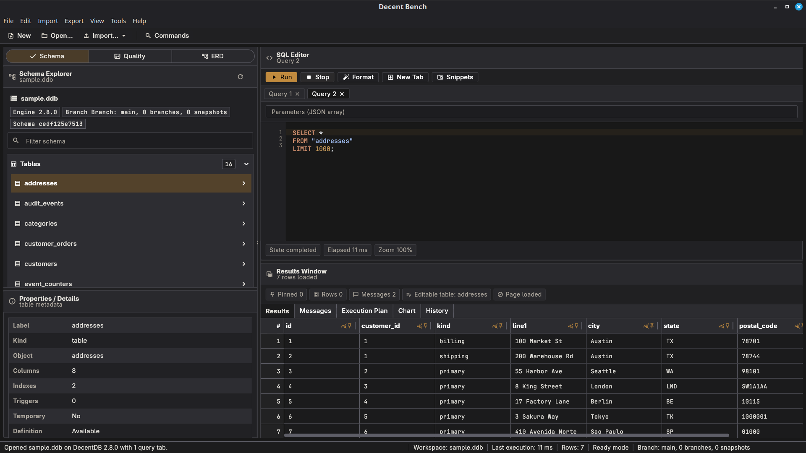

<p align="center">
  
</p>

<h1 align="center">Decent Bench</h1>

<p align="center">
  <strong>The modern, local-first DecentDB desktop workbench.</strong>
</p>

<p align="center">
  <a href="https://github.com/sphildreth/decent-bench/actions/workflows/flutter-build.yml">
    
  </a>
  <a href="https://github.com/sphildreth/decent-bench/releases">
    
  </a>
  <a href="LICENSE">
    
  </a>
  
  
</p>

<p align="center">
  Import supported delimited, structured, spreadsheet, database, dump, and archive-wrapped sources into DecentDB, inspect schema, iterate on SQL in a multi-tab editor, visualize results, and export shaped data from a fast, responsive desktop app built with Flutter.
</p>

<p align="center">
  <a href="#-features">Features</a> •
  <a href="#-getting-started">Getting Started</a> •
  <a href="#-developer-onboarding">Developer Onboarding</a> •
  <a href="#-contributing">Contributing</a>
</p>

<p align="center">
  
</p>

---

## ✨ Features

- 🚀 **DecentDB-First:** A fully local-first workflow. Fast open/create,
  recent files, intuitive drag-and-drop support, and guided legacy `.ddb`
  migration through the official `decentdb-migrate` tool.
- 📥 **Module-Backed Import System:** Open DecentDB files directly and import
  clipboard tables, CSV/TSV, custom-delimited and fixed-width text,
  JSON/NDJSON/log streams, XML/SpreadsheetML, HTML and Markdown tables, Excel,
  OpenDocument spreadsheets, SQLite, SQL dumps, HAR files, and wrapped archives
  (`.zip`, `.gz`, `.tgz`, `.bz2`, `.tbz2`, `.xz`, `.txz`). Built-in TOML module
  manifests declare current support, partial support, future-format backlog
  status, capabilities, limitations, fixture notes, and adapter bindings so
  future format work starts from a catalog instead of hardcoded one-offs.
- 🧪 **Import Wizard UX:** Import flows include previews, table/sheet
  selection where applicable, rename/type-override transforms, row-local
  filters/defaults/computed columns/dedup plans for generic imports, progress
  reporting, blocking failure dialogs, and post-import summaries.
- 🛠️ **Modern SQL Workbench:** Iterate in a multi-tab editor with isolated per-tab results, schema-aware autocomplete, editable snippets, deterministic formatting, typed parameter fields, per-tab query history, and a searchable command palette.
- ⚡ **Performance-Focused:** Background imports, paginated/streamed results grids, and best-effort query cancellation ensure the UI never freezes.
- 🧭 **Rich Engine Metadata:** Schema browsing is powered by DecentDB's rich
  upstream schema snapshot (tables/views/indexes/triggers, checks, foreign keys,
  generated columns, temp-object metadata, and canonical DDL), with v2.6.x
  tooling metadata and query contracts used for schema fingerprints, parameter
  types, and result-column types.
- 📊 **DecentDB v2.6 Diagnostics:** Database Statistics includes WAL, storage,
  write-queue, sync, reactive, relay, and Lua extension inspection surfaces,
  plus optional queued inline table edits and a read-only local Web Console
  launcher.
- 🧬 **Native Type Awareness:** DecentDB v2.6.x semantic and spatial types are
  surfaced in schema details, result metadata, autocomplete, snippets, import
  type overrides, copy behavior, and CSV export display values.
- 📊 **Diagnostics & Visualization:** Column statistics, database statistics,
  EXPLAIN visualization, and result charts help users understand data and query
  behavior without leaving the workspace.
- ✅ **Data Quality Suite:** A first-class Quality workspace profiles tables
  columns, and query results, runs schema-derived or custom validation profiles,
  records import reconciliation, summarizes duplicate checks, pages violation
  details, tracks stale runs, offers post-import quality actions, and exports
  privacy-aware Markdown, HTML, or JSON quality reports.
- 🗺️ **Read-Only ERD Viewer:** Inspect table relationships from loaded
  foreign-key metadata in the navigation pane, search tables/columns, jump from
  ERD nodes to limited table-preview queries, and export full diagrams or the
  current viewport as PNG/JPG.
- 🛡️ **Safer SQL Execution:** Query contracts and SQL risk classification power
  typed parameters, result-column metadata, and prompts before mutating or
  destructive statements. Native branch execution is surfaced as unavailable
  until the Dart binding exposes public branch APIs.
- 🎨 **Workspace Persistence:** Application preferences, including desktop window size, state, and monitor placement, are stored as TOML. Per-database workspace state is stored separately for reliable tab and query restoration.
- 🪵 **Operational Visibility:** Open the DecentDB-backed application log database directly from `Tools -> View Log`.
- 🧪 **Import Validation:** Blocking failure dialogs and richer import summaries make unsuccessful imports obvious and successful imports easier to verify.
- 📤 **Typed Exports:** CSV, JSON, NDJSON, and Excel export stream result pages
  and preserve DecentDB v2.6.x native value metadata where the format supports
  it. Result charts can be exported as PNG, and ERDs can be exported as PNG/JPG.
- 📦 **Desktop Native:** Packaged for Linux, macOS, and Windows with a repeatable native-library staging helper.

### Supported File Types

This table reflects the formats that are currently supported by the app build.
The complete module catalog, including planned and deferred formats, lives under
`apps/decent-bench/import_modules/builtin/`.

| File type | Current status | Details |
| --- | --- | --- |
| `.ddb` | **Complete: Open / Migrate** | Current-format files open directly. Legacy format-version failures offer a copy-based `decentdb-migrate` upgrade path. |
| `.csv`, `.tsv` | **Complete: Import Wizard** | CSV/TSV import through the generic delimited-text pipeline. |
| Clipboard tables | **Complete: Source Import** | Explicit clipboard import for tabular text and sanitized HTML tables. |
| `.txt`, `.dat`, `.log`, `.psv`, `.fwf` | **Complete: Import Wizard** | Generic custom-delimited and fixed-width import with header, delimiter/boundary, quoting, malformed-row, preview, and type-override controls. |
| `.json`, `.ndjson`, `.jsonl` | **Complete: Import Wizard** | Structured JSON, line-oriented JSON, and JSON log stream import with relational previews and flattening/normalization choices. |
| `.xml` | **Complete: Import Wizard** | XML import with flatten or parent-child normalization strategies, plus strict SpreadsheetML routing for Excel XML Spreadsheet files. |
| `.html`, `.htm` | **Complete: Import Wizard** | HTML table extraction with table selection and header inference. |
| `.md` | **Complete: Import Wizard** | Markdown pipe table extraction with multiple-table previews and malformed-row warnings. |
| `.xlsx` | **Complete: Import Wizard** | Workbook import with worksheet selection and DecentDB type mapping. |
| `.xls` | **Partial: Warning Path** | Routed through the legacy Excel path and may require conversion/normalization warnings. |
| `.ods` | **Complete: Import Wizard** | OpenDocument Spreadsheet extraction with worksheet previews. |
| `.db`, `.sqlite`, `.sqlite3` | **Complete: Import Wizard** | SQLite import with schema preview and table selection. |
| `.sql` | **Complete for common MySQL/MariaDB/PostgreSQL plain dumps** | Supports the current dump scope: `CREATE TABLE`, common `INSERT ... VALUES` patterns, and PostgreSQL `COPY FROM stdin` rows. |
| `.har` | **Complete: Import Wizard** | Browser HTTP archive profile with linked request, timing, header, and response tables. |
| `.zip` | **Complete: Wrapper** | Discovers supported inner files and routes them to the normal import flow. |
| `.gz`, `.tar.gz`, `.tgz` | **Complete: Wrapper** | Supports single-file gzip unwrap and tar+gzip archive inspection/extraction. |
| `.bz2`, `.tar.bz2`, `.tbz2` | **Complete: Wrapper** | Supports single-file bzip2 unwrap and tar+bzip2 archive inspection/extraction. |
| `.xz`, `.tar.xz`, `.txz` | **Complete: Wrapper** | Supports bounded single-file xz unwrap and tar+xz archive inspection/extraction. |

### Import Catalog And Format Roadmap

The import system separates shipped import support from future format planning:

- `apps/decent-bench/import_modules/builtin/` is the source of truth for
  built-in module manifests and per-format README files.
- `apps/decent-bench/assets/help/importing-data.md` is the user-facing list of
  formats this build can open/import, plus the native imports that are
  explicitly not supported.
- [`design/WIN_IMPORT_MODULAR_PLAN.md`](design/WIN_IMPORT_MODULAR_PLAN.md)
  explains the module-based import architecture.
- [`design/WIN_IMPORT_FORMAT_EXPANSION_PLAN.md`](design/WIN_IMPORT_FORMAT_EXPANSION_PLAN.md)
  is the single backlog for import formats users cannot import yet.

Recognized or planned examples include Parquet, DuckDB, YAML, Microsoft Access,
DBF/FoxPro, SQL Server backups, and PDF table extraction. The wider roadmap also tracks
analytical, data-lake, geospatial, scientific, finance, healthcare, cloud/SaaS,
log/event, security, email/calendar/contact, document/metadata, and
legacy/mainframe import families. Recognized does not mean import is available;
it means the product has an explicit tracking entry and status for future work.

## 🚀 Getting Started (End Users)

*Binary releases for Linux, macOS, and Windows are listed on the [Releases](https://github.com/sphildreth/decent-bench/releases) page.*

### Command-line Launch
Packaged desktop builds expose a small CLI surface for direct-open and import
flows:
```bash
dbench /path/to/workspace.ddb
dbench --import /path/to/source.xlsx
dbench --in /path/to/source.sqlite --out /tmp/import.ddb
dbench quality --database /path/to/workspace.ddb --profile /path/to/profile.toml --out /tmp/quality-report.json --format json
dbench --version
```

- Passing a `.ddb` path opens that workspace directly.
- `--import` reuses drag-and-drop detection rules and opens the matching wizard.
- `--in` / `--out` run the shipped headless import path.
- `--silent` suppresses headless progress output.
- `--plan` loads and validates a versioned import/export profile document for
  repeatable headless workflows.
- `quality` runs a saved quality profile without the UI and writes Markdown,
  HTML, or JSON reports. Use `dbench quality --help` for target-table, sampled
  mode, and report privacy flags.
- `--help` and `--version` print CLI help and the app version.

## 💻 Developer Onboarding

Want to build from source or contribute? Welcome! 

### Prerequisites

- **Git**
- **Flutter** (stable, desktop tooling enabled)
- OS-specific native toolchain (C++ compiler, etc.)
- `tar` on systems where you want tar+gzip or tar+bzip2 archive detection and extraction
- A matching **DecentDB native library** for the pinned app version

Decent Bench pins the upstream Dart package by Git tag and expects the matching
DecentDB desktop native library alongside it. CI and release packaging currently
resolve `v2.6.0` from `apps/decent-bench/pubspec.lock` and download the matching
`decentdb-dart-native-<tag>-...` asset from
[`sphildreth/decentdb` Releases](https://github.com/sphildreth/decentdb/releases).

### 1. Bootstrap the Flutter App
```bash
cd apps/decent-bench
flutter pub get
```

### 2. Install the Matching DecentDB Native Library
The app and test tooling resolve the pinned `decentdb` tag from
`apps/decent-bench/pubspec.lock` and download the matching
`decentdb-dart-native-<tag>-...` release asset from DecentDB Releases into a
local cache when needed. The app still prefers a bundled native library first,
then the cached pinned asset, then common system locations.

### 3. Run Locally
```bash
flutter run -d linux
```

### 4. Testing & Validation
```bash
flutter analyze
flutter test
flutter test integration_test
```

These commands will fetch the matching pinned DecentDB native library on first
use if it is not already cached. Legacy `.ddb` migration also resolves the
official `decentdb-migrate` executable from PATH, an explicit
`DECENTDB_MIGRATE_PATH`, a packaged app bundle, or the pinned full DecentDB
release asset. The optional Web Console workflow resolves the official
`decentdb` CLI from PATH, `DECENTDB_CLI_PATH`, a packaged bundle, or the same
pinned full release asset.

### 5. Packaging Desktop Builds
Build the bundle, then use the staging helper to inject the DecentDB native
library, `decentdb-migrate`, and the `decentdb` CLI. The `--source` path can
point at either an extracted `decentdb-dart-native-<tag>-...` release asset or a
local DecentDB build, `--migration-tool-source` can point at a local migration
executable, and `--cli-source` can point at a local CLI executable:
```bash
flutter build linux
dart run tool/stage_decentdb_native.dart --bundle build/linux/x64/release/bundle
dart run tool/stage_decentdb_native.dart --bundle build/linux/x64/release/bundle --source /path/to/libdecentdb.so --migration-tool-source /path/to/decentdb-migrate --cli-source /path/to/decentdb
```
If `--source` is omitted, the helper resolves and downloads the pinned matching
DecentDB native release asset automatically. If `--migration-tool-source` is
omitted, it resolves the official migration tool from the pinned full release
asset. If `--cli-source` is omitted, it resolves the official CLI from the
pinned full release asset.

*(For macOS use `build/macos/Build/Products/Release/decent_bench.app` and
Windows `build/windows/x64/runner/Release`.)*

## 🏗️ Architecture & Configuration

The application stores its local state under the platform app-support
directory:
- **Linux:** `~/.config/decent-bench/`
- **macOS:** `~/Library/Application Support/Decent Bench/`
- **Windows:** `%APPDATA%\Decent Bench\`

Typical files under that root include:
- `config.toml` for application preferences
- per-workspace `.json` state files for saved tabs/history/restoration
- `decent-bench-log.ddb` for the application log database opened by
  `Tools -> View Log`

**Project Source of Truth:**
- 📐 [`design/PRD.md`](design/PRD.md) — Product goals and user journeys
- 📝 [`design/SPEC.md`](design/SPEC.md) — Implementation scope (Authoritative)
- 📥 [`apps/decent-bench/assets/help/importing-data.md`](apps/decent-bench/assets/help/importing-data.md) —
  Current user-facing import support
- 🗂️ [`design/WIN_IMPORT_FORMAT_EXPANSION_PLAN.md`](design/WIN_IMPORT_FORMAT_EXPANSION_PLAN.md) —
  Future import format backlog and prioritization
- 🧠 [`design/adr/README.md`](design/adr/README.md) — Architecture Decision Records
- 🤖 [`AGENTS.md`](AGENTS.md) — Agent instructions and guardrails

## 🤝 Contributing

We love contributions! Before making non-trivial changes, please review the [`SPEC.md`](design/SPEC.md) and our [`AGENTS.md`](AGENTS.md) guidelines.

**Core Rules:**
1. **Performance First:** Keep heavy work off the UI thread. Use isolates.
2. **Paging Everywhere:** Stream data, never fully materialize large results.
3. **ADRs are Mandatory:** Document lasting architectural or product-impacting decisions.
4. **License Compliance:** Only add Apache 2.0 compatible dependencies.


## 📄 License & Attribution

Decent Bench is open-source under the [Apache License 2.0](LICENSE).  
For third-party dependencies and attributions, see [THIRD_PARTY_NOTICES.md](THIRD_PARTY_NOTICES.md).
